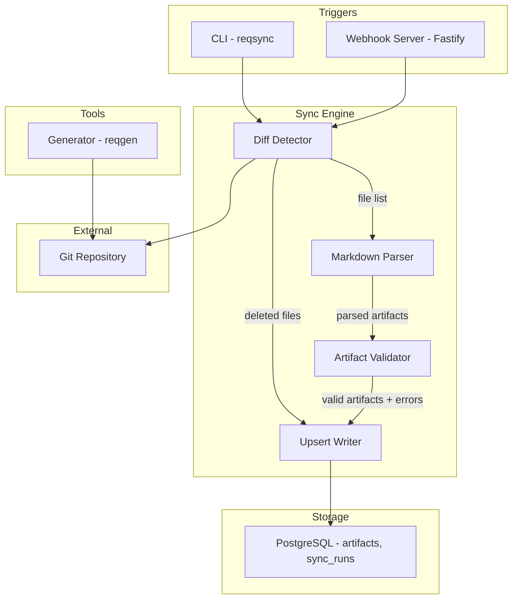
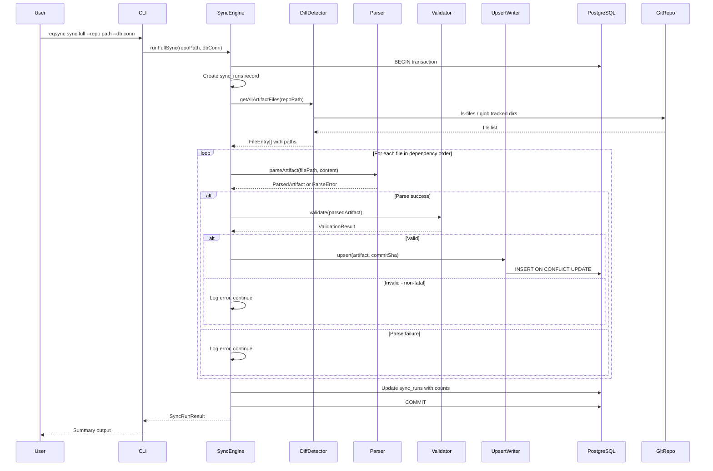
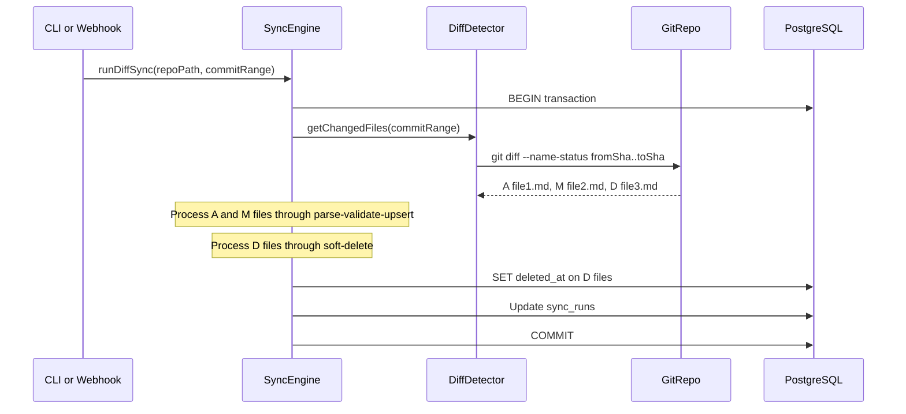
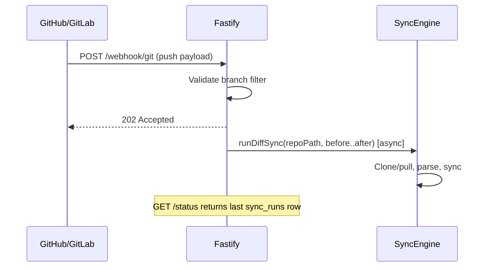
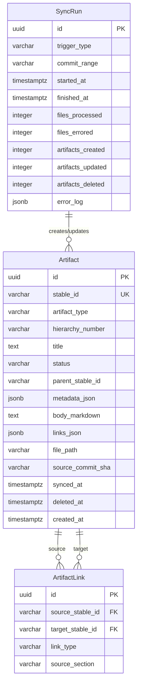

# Technical Design: git-db-sync

## Overview

**Purpose**: This feature delivers a complete Git-to-PostgreSQL synchronization pipeline that parses structured Markdown artifact files from a spec repository and materializes them into a relational database, enabling queryable access to all 16 artifact types with their traceability links.

**Users**: Developers and requirements engineers use the CLI tool (`reqsync`) for manual sync operations and validation, while CI/CD pipelines use the webhook server for automated sync on push events. The test repository generator (`reqgen`) supports developers in creating realistic test data.

**Impact**: Establishes the foundational data layer for the requirements management application. All downstream features (UI, MCP server, traceability queries, agent workflows) depend on this sync pipeline producing an accurate, up-to-date database mirror.

### Goals
- Parse all 16 artifact types from structured Markdown into typed database rows
- Support both full and incremental (diff-based) sync with idempotent semantics
- Provide CLI and webhook interfaces for manual and automated sync triggers
- Generate realistic test repositories with configurable scale and git history

### Non-Goals
- Web UI or REST API layer beyond the webhook endpoint
- DB → Git reverse sync or conflict resolution
- Authentication, authorization, or multi-tenancy
- Performance optimization for repositories exceeding 1,000 artifacts
- Electronic signatures, baselines, or compliance audit trails

## Architecture

### Architecture Pattern & Boundary Map

**Selected pattern**: Linear pipeline (Diff → Parse → Validate → Upsert) — chosen for its direct mapping to the data flow, simple mental model, and ease of testing each stage in isolation. See `research.md` Architecture Pattern Evaluation for alternatives considered.



**Domain boundaries**:
- **Sync Engine** owns the pipeline orchestration, parsing, validation, and database writes. All four internal components share types but have distinct responsibilities.
- **CLI / Webhook** are thin entry points that configure and invoke the Sync Engine — they do not contain business logic.
- **Generator** is an independent tool that produces test repositories; it shares type definitions (artifact types, stable ID format) but has no runtime dependency on the Sync Engine.

**New components rationale**: All components are net-new (greenfield). Each maps to a distinct PRD-defined responsibility with clear input/output contracts.

### Technology Stack

| Layer | Choice / Version | Role in Feature | Notes |
|-------|------------------|-----------------|-------|
| Runtime | Node.js 20+ / TypeScript 5.x | Application runtime and type system | ESM modules, strict mode |
| CLI Framework | Commander.js 13.x | Subcommand routing for `reqsync` and `reqgen` | Nested commands, global options |
| HTTP Server | Fastify 5.x | Webhook endpoint (`/webhook/git`) and status endpoint | Minimal, TypeScript-native |
| ORM | Drizzle ORM 1.x + Drizzle Kit | Schema-as-code, migrations, typed queries | `onConflictDoUpdate` for upserts, JSONB support |
| Database | PostgreSQL 16 | Artifact storage, sync logs | JSONB for metadata and links |
| Git Integration | simple-git 3.x | Diff detection, file listing, commit range resolution | `raw()` for `--name-status` parsing |
| Markdown Parsing | unified 11.x + remark-parse 11.x | AST-based Markdown parsing | mdast tree walked by custom visitors |
| AST Utilities | unist-util-visit 5.x, mdast-util-to-string 4.x | AST traversal and text extraction | Used by parser visitors |
| Template Rendering | Handlebars 4.x | Artifact file generation in `reqgen` | 16 artifact templates |
| Seeded RNG | seedrandom 3.x | Deterministic generator output | Reproducible with `--seed` |
| Test Runner | Vitest 3.x | Unit and integration tests | TypeScript-native, fast |
| Build | tsx (dev) / tsup (build) | TypeScript execution and bundling | Zero-config for PoC |

## System Flows

### Full Sync Flow



### Diff Sync Flow



### Webhook Async Dispatch



## Requirements Traceability

| Requirement | Summary | Components | Interfaces | Flows |
|-------------|---------|------------|------------|-------|
| 1.1 | Extract Identification fields | MarkdownParser | ParsedArtifact | Full/Diff Sync |
| 1.2 | Extract Metadata fields | MarkdownParser | ParsedArtifact | Full/Diff Sync |
| 1.3 | Capture freeform body | MarkdownParser | ParsedArtifact | Full/Diff Sync |
| 1.4 | Extract link references | MarkdownParser, LinkExtractor | ArtifactLink | Full/Diff Sync |
| 1.5 | Extract H1 title | MarkdownParser | ParsedArtifact | Full/Diff Sync |
| 1.6 | Parse all 16 types | MarkdownParser | ArtifactType enum | Full/Diff Sync |
| 1.7 | Skip non-artifact files | DiffDetector, MarkdownParser | FileFilter | Full/Diff Sync |
| 1.8 | Skip traceability matrices | DiffDetector | FileFilter | Full/Diff Sync |
| 2.1 | Resolve changed files in range | DiffDetector | DiffResult | Diff Sync |
| 2.2 | Include A/M files for upsert | DiffDetector | DiffResult | Diff Sync |
| 2.3 | Include D files for soft-delete | DiffDetector | DiffResult | Diff Sync |
| 2.4 | Walk entire tree for full sync | DiffDetector | FileEntry | Full Sync |
| 2.5 | Ignore non-artifact directories | DiffDetector | TRACKED_DIRS config | Full/Diff Sync |
| 3.1 | Verify stable ID matches filename | Validator | ValidationResult | Full/Diff Sync |
| 3.2 | Check required fields per type | Validator | ValidationResult | Full/Diff Sync |
| 3.3 | Warn on malformed reference IDs | Validator | ValidationResult | Full/Diff Sync |
| 3.4 | Detect duplicate stable IDs | Validator | ValidationResult | Full/Diff Sync |
| 3.5 | Log errors, continue processing | SyncEngine | SyncRunResult | Full/Diff Sync |
| 3.6 | Non-blocking validation | Validator, SyncEngine | ValidationResult | Full/Diff Sync |
| 4.1 | Artifacts table schema | DrizzleSchema | artifacts table | — |
| 4.2 | Sync runs table schema | DrizzleSchema | sync_runs table | — |
| 4.3 | Drizzle ORM schema definitions | DrizzleSchema | Drizzle Kit migrations | — |
| 4.4 | Unique index on stable_id | DrizzleSchema | artifacts table | — |
| 4.5 | JSONB metadata storage | DrizzleSchema | artifacts.metadata_json | — |
| 4.6 | JSONB links storage | DrizzleSchema | artifacts.links_json | — |
| 5.1 | Insert new artifacts | UpsertWriter | upsertArtifact | Full/Diff Sync |
| 5.2 | Update existing artifacts | UpsertWriter | upsertArtifact | Full/Diff Sync |
| 5.3 | Soft-delete removed artifacts | UpsertWriter | softDeleteArtifact | Diff Sync |
| 5.4 | Idempotent sync | UpsertWriter | onConflictDoUpdate | Full/Diff Sync |
| 5.5 | Transaction rollback on system error | SyncEngine | db.transaction | Full/Diff Sync |
| 5.6 | Per-file error isolation | SyncEngine | try/catch per file | Full/Diff Sync |
| 5.7 | Provenance tracking (SHA, path) | UpsertWriter | artifacts columns | Full/Diff Sync |
| 5.8 | Sync run logging | SyncEngine | sync_runs record | Full/Diff Sync |
| 6.1 | sync full command | ReqsyncCLI | Commander program | Full Sync |
| 6.2 | sync diff command | ReqsyncCLI | Commander program | Diff Sync |
| 6.3 | sync diff HEAD~1 shorthand | ReqsyncCLI | Commander program | Diff Sync |
| 6.4 | validate command | ReqsyncCLI | Commander program | — |
| 6.5 | status command | ReqsyncCLI | Commander program | — |
| 6.6 | --repo and --db options | ReqsyncCLI | Commander options | — |
| 7.1 | POST /webhook/git triggers sync | WebhookServer | Fastify route | Webhook Async |
| 7.2 | Return 202 Accepted immediately | WebhookServer | Fastify route | Webhook Async |
| 7.3 | GET /status returns last sync | WebhookServer | Fastify route | — |
| 7.4 | Branch filter configuration | WebhookServer | ServerConfig | Webhook Async |
| 7.5 | Ignore non-configured branches | WebhookServer | branch filter | Webhook Async |
| 7.6 | Clone/pull before sync | WebhookServer | GitRepo management | Webhook Async |
| 8.1 | Generate complete repo structure | ReqgenGenerator | GeneratorConfig | — |
| 8.2 | Configurable scale options | ReqgenCLI | Commander options | — |
| 8.3 | Deterministic with --seed | ReqgenGenerator | seedrandom PRNG | — |
| 8.4 | Sequential stable IDs | ReqgenGenerator | ID assignment | — |
| 8.5 | Valid traceability links | LinkGraphBuilder | ArtifactLink | — |
| 8.6 | Cross-cutting link assignment | LinkGraphBuilder | seedrandom PRNG | — |
| 8.7 | Multi-commit git history | GitHistoryBuilder | simple-git | — |
| 8.8 | Malformed file injection | ReqgenGenerator | MalformedFileConfig | — |
| 8.9 | Traceability matrix generation | ReqgenGenerator | matrix templates | — |
| 8.10 | Static doc generation | ReqgenGenerator | static templates | — |
| 9.1 | Dependency-order processing | SyncEngine | ARTIFACT_TYPE_ORDER | Full Sync |
| 9.2 | Links stored in links_json | UpsertWriter | ArtifactLink | Full/Diff Sync |
| 9.3 | Inline acceptance criteria parsing | MarkdownParser | ParsedArtifact.metadata_json | Full/Diff Sync |
| 10.1 | artifact_links table (stretch) | DrizzleSchema | artifact_links table | — |
| 10.2 | Second-pass link resolution (stretch) | LinkResolver | resolveLinks | Full Sync |
| 10.3 | Dangling reference detection (stretch) | LinkResolver | ValidationResult | Full Sync |

## Components and Interfaces

| Component | Domain/Layer | Intent | Req Coverage | Key Dependencies | Contracts |
|-----------|-------------|--------|--------------|------------------|-----------|
| MarkdownParser | Parser | Extract structured data from Markdown artifact files | 1.1–1.8, 9.3 | unified, remark-parse (P0) | Service |
| DiffDetector | Sync | Resolve changed files from git history or full tree walk | 2.1–2.5 | simple-git (P0) | Service |
| Validator | Sync | Validate parsed artifacts against type-specific rules | 3.1–3.6 | — | Service |
| UpsertWriter | Sync/DB | Insert, update, or soft-delete artifact rows | 5.1–5.4, 5.7, 9.2 | Drizzle ORM (P0), PostgreSQL (P0) | Service |
| SyncEngine | Sync | Orchestrate the full pipeline within a transaction | 5.5, 5.6, 5.8, 9.1 | All sync components (P0) | Service |
| DrizzleSchema | DB | Define artifacts, sync_runs, artifact_links tables | 4.1–4.6, 10.1 | Drizzle ORM (P0) | State |
| ReqsyncCLI | CLI | Entry point for reqsync commands | 6.1–6.6 | Commander.js (P0), SyncEngine (P0) | — |
| WebhookServer | HTTP | Fastify server with webhook and status endpoints | 7.1–7.6 | Fastify (P0), SyncEngine (P0) | API |
| ReqgenGenerator | Generator | Produce complete spec repositories | 8.1, 8.3–8.4, 8.8–8.10 | Handlebars (P0), seedrandom (P1) | Service |
| ReqgenCLI | CLI | Entry point for reqgen commands | 8.2 | Commander.js (P0), ReqgenGenerator (P0) | — |
| LinkGraphBuilder | Generator | Build traceability link graph for generated repos | 8.5–8.6 | seedrandom (P1) | Service |
| GitHistoryBuilder | Generator | Create multi-commit git history | 8.7 | simple-git (P0) | Service |

### Parser Layer

#### MarkdownParser

| Field | Detail |
|-------|--------|
| Intent | Parse a single Markdown artifact file into a structured object |
| Requirements | 1.1, 1.2, 1.3, 1.4, 1.5, 1.6, 1.7, 1.8, 9.3 |

**Responsibilities & Constraints**
- Owns the Markdown-to-structured-data transformation for all 16 artifact types
- Uses `unified` + `remark-parse` to produce an mdast AST, then walks nodes with custom visitors
- Does NOT validate content — only extracts what is present
- Returns `ParsedArtifact` on success or `ParseError` on structural failure

**Dependencies**
- External: `unified` + `remark-parse` — AST construction (P0)
- External: `unist-util-visit` — AST traversal (P0)
- External: `mdast-util-to-string` — text extraction from AST nodes (P1)

**Contracts**: Service [x]

##### Service Interface

```typescript
interface MarkdownParserService {
  parseArtifact(filePath: string, content: string): Result<ParsedArtifact, ParseError>;
}

interface ParsedArtifact {
  stableId: string;
  artifactType: ArtifactType;
  title: string;
  hierarchyNumber: string | null;
  parentStableId: string | null;
  status: string | null;
  owner: string | null;
  priority: string | null;
  metadata: Record<string, string>;
  bodyMarkdown: string;
  sections: Map<string, string>;
  links: ArtifactLink[];
}

interface ArtifactLink {
  targetId: string;
  linkType: string;
  section: string;
}

interface ParseError {
  filePath: string;
  message: string;
  line: number | null;
}
```

- Preconditions: `content` is a non-empty UTF-8 string; `filePath` is relative to repo root
- Postconditions: Returns `Ok<ParsedArtifact>` with all extractable fields populated, or `Err<ParseError>` if file lacks a parseable H1 or Identification section
- Invariants: The same content always produces the same output (stateless, pure)

**Implementation Notes**
- Artifact type is inferred from the stable ID prefix extracted from the Identification section
- Files not matching any of the 16 known prefixes are rejected with a `ParseError` that the caller can treat as a skip (1.7)
- Traceability matrix files are filtered upstream by DiffDetector (1.8); parser does not special-case them
- Inline acceptance criteria are preserved in `bodyMarkdown` and extracted as structured entries in `metadata` under an `acceptanceCriteria` key (9.3)

### Sync Layer

#### DiffDetector

| Field | Detail |
|-------|--------|
| Intent | Resolve the list of artifact files to process based on sync mode |
| Requirements | 2.1, 2.2, 2.3, 2.4, 2.5 |

**Responsibilities & Constraints**
- For diff sync: uses `simple-git` `raw(['diff', '--name-status', range])` to get A/M/D file statuses
- For full sync: walks tracked directories and returns all `.md` files
- Filters results to only include files within `TRACKED_DIRS` (the 14 artifact directories)
- Does NOT read file contents — only resolves paths and statuses

**Dependencies**
- External: `simple-git` — git operations (P0)

**Contracts**: Service [x]

##### Service Interface

```typescript
interface DiffDetectorService {
  getChangedFiles(repoPath: string, commitRange: string): Promise<DiffResult>;
  getAllArtifactFiles(repoPath: string): Promise<FileEntry[]>;
}

interface DiffResult {
  toUpsert: FileEntry[];
  toDelete: FileEntry[];
}

interface FileEntry {
  filePath: string;
  status: 'A' | 'M' | 'D' | 'full';
}

const TRACKED_DIRS: readonly string[] = [
  'docs/01-roadmap/epics',
  'docs/01-roadmap/milestones',
  'docs/01-roadmap/release-slices',
  'docs/02-requirements/functional',
  'docs/02-requirements/non-functional',
  'docs/02-requirements/business-rules',
  'docs/03-delivery-backlog/user-stories',
  'docs/03-delivery-backlog/enablers',
  'docs/04-use-cases',
  'docs/05-domain-model/entities',
  'docs/06-api/endpoints',
  'docs/07-architecture/adrs',
  'docs/08-ux/screens',
  'docs/09-security/abuse-cases',
  'docs/10-operations/runbooks',
  'docs/11-evals/scenarios',
] as const;
```

- Preconditions: `repoPath` points to a valid git repository; `commitRange` follows `sha1..sha2` or `HEAD~N` format
- Postconditions: `toUpsert` contains only files with status A or M in tracked dirs; `toDelete` contains only files with status D in tracked dirs
- Invariants: Files outside `TRACKED_DIRS` are never returned

#### Validator

| Field | Detail |
|-------|--------|
| Intent | Validate parsed artifacts against type-specific rules |
| Requirements | 3.1, 3.2, 3.3, 3.4 |

**Responsibilities & Constraints**
- Checks stable ID in body matches filename prefix
- Verifies required fields are present per artifact type
- Warns on malformed artifact ID references
- Detects duplicate stable IDs within a sync batch
- Returns validation result without throwing — caller decides how to handle

**Dependencies**
- Inbound: SyncEngine passes `ParsedArtifact[]` for batch duplicate detection (P0)

**Contracts**: Service [x]

##### Service Interface

```typescript
interface ValidatorService {
  validateArtifact(artifact: ParsedArtifact, filePath: string): ValidationResult;
  validateBatch(artifacts: ParsedArtifact[]): ValidationResult[];
}

interface ValidationResult {
  valid: boolean;
  errors: ValidationError[];
  warnings: ValidationWarning[];
}

interface ValidationError {
  filePath: string;
  field: string;
  message: string;
  code: 'STABLE_ID_MISMATCH' | 'MISSING_REQUIRED_FIELD' | 'DUPLICATE_STABLE_ID';
}

interface ValidationWarning {
  filePath: string;
  message: string;
  code: 'MALFORMED_REFERENCE';
}

type RequiredFieldsMap = Record<ArtifactType, readonly string[]>;
```

- Preconditions: `artifact` is a successfully parsed `ParsedArtifact`
- Postconditions: Returns `ValidationResult` with all detected errors and warnings; `valid` is `true` only if `errors` is empty
- Invariants: Validation is stateless per artifact; batch validation only adds duplicate detection

#### UpsertWriter

| Field | Detail |
|-------|--------|
| Intent | Write parsed artifacts to PostgreSQL via upsert and soft-delete |
| Requirements | 5.1, 5.2, 5.3, 5.4, 5.7, 9.2 |

**Responsibilities & Constraints**
- Uses Drizzle ORM `insert().onConflictDoUpdate({ target: artifacts.stableId })` for upsert
- Sets `deleted_at = now()` for soft-deletes
- Records `source_commit_sha` and `file_path` on every write
- Operates within a transaction provided by SyncEngine

**Dependencies**
- External: Drizzle ORM — database operations (P0)
- Inbound: SyncEngine provides transaction context (`tx`) (P0)

**Contracts**: Service [x]

##### Service Interface

```typescript
interface UpsertWriterService {
  upsertArtifact(
    tx: DrizzleTransaction,
    artifact: ParsedArtifact,
    commitSha: string,
    filePath: string
  ): Promise<UpsertResult>;

  softDeleteArtifacts(
    tx: DrizzleTransaction,
    stableIds: string[],
    commitSha: string
  ): Promise<number>;
}

interface UpsertResult {
  stableId: string;
  action: 'created' | 'updated';
}

type DrizzleTransaction = Parameters<
  Parameters<typeof db.transaction>[0]
>[0];
```

- Preconditions: `tx` is an active Drizzle transaction; `artifact` has passed validation
- Postconditions: Row exists in `artifacts` with current data; `synced_at` is updated; `source_commit_sha` matches provided SHA
- Invariants: `stable_id` uniqueness is enforced by database constraint; duplicate upserts produce identical state (idempotent)

#### SyncEngine

| Field | Detail |
|-------|--------|
| Intent | Orchestrate the diff-parse-validate-upsert pipeline within a transaction |
| Requirements | 5.5, 5.6, 5.8, 9.1 |

**Responsibilities & Constraints**
- Opens a single database transaction for the entire sync run
- Processes files in dependency order: EPIC → MS → REL → US → EN → FR → NFR → BR → UC → ENT → API → SCR → ADR → AB → RB → EV
- Wraps each file's parse-validate-upsert in try/catch; logs errors without aborting transaction
- Creates a `sync_runs` record with accurate counts on completion

**Dependencies**
- Inbound: CLI or Webhook provides repoPath, dbConn, and trigger context (P0)
- Outbound: DiffDetector, MarkdownParser, Validator, UpsertWriter — all P0

**Contracts**: Service [x]

##### Service Interface

```typescript
interface SyncEngineService {
  runFullSync(config: SyncConfig): Promise<SyncRunResult>;
  runDiffSync(config: SyncConfig, commitRange: string): Promise<SyncRunResult>;
  runValidateOnly(config: SyncConfig): Promise<ValidationReport>;
}

interface SyncConfig {
  repoPath: string;
  dbConnectionString: string;
}

interface SyncRunResult {
  syncRunId: string;
  triggerType: 'cli_full' | 'cli_diff' | 'webhook';
  commitRange: string;
  filesProcessed: number;
  filesErrored: number;
  artifactsCreated: number;
  artifactsUpdated: number;
  artifactsDeleted: number;
  errors: Array<{ filePath: string; message: string }>;
  duration: number;
}

interface ValidationReport {
  totalFiles: number;
  validFiles: number;
  errors: ValidationError[];
  warnings: ValidationWarning[];
}

const ARTIFACT_TYPE_ORDER: readonly ArtifactType[] = [
  'EPIC', 'MS', 'REL', 'US', 'EN', 'FR', 'NFR', 'BR',
  'UC', 'ENT', 'API', 'SCR', 'ADR', 'AB', 'RB', 'EV',
] as const;
```

- Preconditions: Database is reachable; repo path is a valid git repository
- Postconditions: `sync_runs` row exists with accurate counts; all valid artifacts are upserted; all deleted files are soft-deleted; errors are logged
- Invariants: Transaction rolls back on system-level errors; per-file errors are isolated

##### Batch / Job Contract
- Trigger: CLI command or webhook POST
- Input: Repository path + commit range (or "full") + DB connection
- Output: `SyncRunResult` with counts and error details
- Idempotency: Running the same commit range twice produces identical DB state
- Recovery: On system error, transaction rolls back; re-run is safe

### CLI Layer

#### ReqsyncCLI

| Field | Detail |
|-------|--------|
| Intent | Provide command-line interface for sync operations |
| Requirements | 6.1, 6.2, 6.3, 6.4, 6.5, 6.6 |

**Responsibilities & Constraints**
- Thin wrapper: parses CLI args via Commander.js, invokes SyncEngine methods
- Global options `--repo` and `--db` are required on all commands
- Formats and prints `SyncRunResult` or `ValidationReport` to stdout

**Dependencies**
- External: Commander.js — CLI parsing (P0)
- Outbound: SyncEngine — all sync operations (P0)

**Implementation Notes**
- Command structure: `reqsync sync full`, `reqsync sync diff <range>`, `reqsync validate`, `reqsync status`
- `status` queries the last `sync_runs` row directly via Drizzle (does not go through SyncEngine)
- Exit code 0 on success, 1 on error

### HTTP Layer

#### WebhookServer

| Field | Detail |
|-------|--------|
| Intent | Accept git push webhooks and expose sync status |
| Requirements | 7.1, 7.2, 7.3, 7.4, 7.5, 7.6 |

**Responsibilities & Constraints**
- Fastify server with two routes: `POST /webhook/git` and `GET /status`
- Branch filter configured via environment variable or constructor parameter (default: `main`)
- Returns 202 Accepted immediately; dispatches sync asynchronously via `setImmediate`
- Clones or pulls repo to a local working directory before sync

**Dependencies**
- External: Fastify — HTTP server (P0)
- Outbound: SyncEngine — diff sync execution (P0)
- External: simple-git — repo clone/pull (P1)

**Contracts**: API [x]

##### API Contract

| Method | Endpoint | Request | Response | Errors |
|--------|----------|---------|----------|--------|
| POST | /webhook/git | WebhookPayload | 202 `{ accepted: true }` | 400 invalid payload, 200 ignored branch |
| GET | /status | — | SyncRunResult (last run) | 404 no sync runs |

```typescript
interface WebhookPayload {
  ref: string;
  before: string;
  after: string;
  repository: {
    clone_url: string;
  };
}

interface ServerConfig {
  port: number;
  allowedBranches: string[];
  repoWorkDir: string;
  dbConnectionString: string;
}
```

**Implementation Notes**
- Branch filtering: extract branch name from `ref` (e.g., `refs/heads/main` → `main`), check against `allowedBranches`
- Async dispatch: `setImmediate(() => syncEngine.runDiffSync(...))` — errors are logged to sync_runs, not returned to caller
- Repo management: on first webhook, clone repo; on subsequent, `git pull` to update

### Generator Layer

#### ReqgenGenerator

| Field | Detail |
|-------|--------|
| Intent | Generate a complete spec repository with realistic artifact content |
| Requirements | 8.1, 8.3, 8.4, 8.8, 8.9, 8.10 |

**Responsibilities & Constraints**
- Renders 16 artifact type templates via Handlebars with generated content
- Uses seeded PRNG (`seedrandom`) for all random decisions
- Generates sequential stable IDs per type (`EPIC-001`, `FR-001`, etc.)
- Computes hierarchy numbers from parent-child structure
- Produces traceability matrices and static docs

**Dependencies**
- External: Handlebars — template rendering (P0)
- External: seedrandom — deterministic RNG (P1)
- Outbound: LinkGraphBuilder — traceability link generation (P0)
- Outbound: GitHistoryBuilder — commit history creation (P0)

**Contracts**: Service [x]

##### Service Interface

```typescript
interface ReqgenGeneratorService {
  generate(config: GeneratorConfig): Promise<GeneratorResult>;
}

interface GeneratorConfig {
  outputPath: string;
  epics: number;
  storiesPerEpic: number;
  enablersPerEpic: number;
  reqsPerStory: number;
  crossCutting: number;
  evalsPerReq: number;
  milestones: number;
  releases: number;
  seed: number | null;
  gitHistory: boolean;
  malformed: number;
}

interface GeneratorResult {
  outputPath: string;
  artifactCounts: Record<ArtifactType, number>;
  totalFiles: number;
  commits: number;
  malformedFiles: number;
}
```

#### LinkGraphBuilder

| Field | Detail |
|-------|--------|
| Intent | Build a consistent traceability link graph across generated artifacts |
| Requirements | 8.5, 8.6 |

**Responsibilities & Constraints**
- Creates parent-child links: EPIC ← US/EN ← FR ← EV
- Assigns cross-cutting artifacts to 1–3 parents using seeded PRNG
- Produces the link data used by both artifact templates and traceability matrices

**Dependencies**
- External: seedrandom — deterministic assignment (P1)

##### Service Interface

```typescript
interface LinkGraphBuilderService {
  buildGraph(artifacts: GeneratedArtifactMap, rng: () => number): LinkGraph;
}

interface LinkGraph {
  links: ArtifactLink[];
  getLinksFor(stableId: string): ArtifactLink[];
  getParent(stableId: string): string | null;
}

type GeneratedArtifactMap = Map<ArtifactType, GeneratedArtifactStub[]>;

interface GeneratedArtifactStub {
  stableId: string;
  title: string;
  hierarchyNumber: string;
  parentStableId: string | null;
}
```

#### GitHistoryBuilder

| Field | Detail |
|-------|--------|
| Intent | Create multi-commit git history for generated repositories |
| Requirements | 8.7 |

**Responsibilities & Constraints**
- Creates 7 distinct commits simulating a realistic project evolution
- Uses simple-git to init repo, stage files, and create commits
- Modification commit updates 2–3 artifacts; deletion commit removes 1–2 artifacts

**Dependencies**
- External: simple-git — git operations (P0)

##### Service Interface

```typescript
interface GitHistoryBuilderService {
  buildHistory(repoPath: string, artifacts: StagedCommits): Promise<CommitLog>;
}

interface StagedCommits {
  scaffold: string[];
  epicCommits: Map<string, string[]>;
  requirements: string[];
  crossCutting: string[];
  verification: string[];
  modifications: Array<{ path: string; content: string }>;
  deletions: string[];
  malformed: string[];
}

interface CommitLog {
  commits: Array<{ sha: string; message: string; files: number }>;
}
```

### Stretch Layer

#### LinkResolver (Stretch — Req 10)

| Field | Detail |
|-------|--------|
| Intent | Populate normalized `artifact_links` table from `links_json` |
| Requirements | 10.1, 10.2, 10.3 |

**Responsibilities & Constraints**
- Runs as a second pass after all artifacts are upserted
- Resolves each `links_json` entry against existing artifact rows
- Inserts valid links into `artifact_links`; logs dangling references as warnings

##### Service Interface

```typescript
interface LinkResolverService {
  resolveLinks(tx: DrizzleTransaction): Promise<LinkResolutionResult>;
}

interface LinkResolutionResult {
  linksCreated: number;
  danglingReferences: Array<{ sourceId: string; targetId: string }>;
}
```

## Data Models

### Domain Model

The core domain has two aggregates:

1. **Artifact** — the primary entity representing a single spec document. Identified by `stable_id` (natural key). Contains structured metadata, freeform body, and traceability links. Lifecycle: created → updated → soft-deleted.

2. **SyncRun** — a log entry for each sync execution. Contains counts, errors, and provenance. Immutable after creation.



### Physical Data Model

**artifacts table**

| Column | Type | Constraints | Notes |
|--------|------|-------------|-------|
| id | UUID | PK, DEFAULT gen_random_uuid() | Surrogate key |
| stable_id | VARCHAR(20) | UNIQUE, NOT NULL, INDEXED | Natural key: `EPIC-001` |
| artifact_type | VARCHAR(10) | NOT NULL | Enum-like: one of 16 prefixes |
| hierarchy_number | VARCHAR(30) | NULLABLE | `1.3.R2` |
| title | TEXT | NOT NULL | From H1 heading |
| status | VARCHAR(30) | NULLABLE | `Draft`, `Approved`, etc. |
| owner | VARCHAR(100) | NULLABLE | |
| priority | VARCHAR(20) | NULLABLE | |
| parent_stable_id | VARCHAR(20) | NULLABLE | Direct parent ref |
| metadata_json | JSONB | NOT NULL, DEFAULT '{}' | All key-value metadata |
| body_markdown | TEXT | NOT NULL, DEFAULT '' | Full Markdown body |
| links_json | JSONB | NOT NULL, DEFAULT '[]' | Array of `{target_id, link_type, section}` |
| file_path | VARCHAR(255) | NOT NULL | Relative to repo root |
| source_commit_sha | VARCHAR(40) | NOT NULL | Last sync commit |
| synced_at | TIMESTAMPTZ | NOT NULL | Last sync timestamp |
| deleted_at | TIMESTAMPTZ | NULLABLE | Soft-delete marker |
| created_at | TIMESTAMPTZ | NOT NULL, DEFAULT now() | First sync timestamp |

Indexes: `UNIQUE(stable_id)`, `INDEX(artifact_type)`, `INDEX(deleted_at)` (for filtering active artifacts).

**sync_runs table**

| Column | Type | Constraints | Notes |
|--------|------|-------------|-------|
| id | UUID | PK, DEFAULT gen_random_uuid() | |
| trigger_type | VARCHAR(20) | NOT NULL | `webhook`, `cli_full`, `cli_diff` |
| commit_range | VARCHAR(100) | NOT NULL | `sha..sha` or `full` |
| started_at | TIMESTAMPTZ | NOT NULL | |
| finished_at | TIMESTAMPTZ | NULLABLE | |
| files_processed | INTEGER | NOT NULL, DEFAULT 0 | |
| files_errored | INTEGER | NOT NULL, DEFAULT 0 | |
| artifacts_created | INTEGER | NOT NULL, DEFAULT 0 | |
| artifacts_updated | INTEGER | NOT NULL, DEFAULT 0 | |
| artifacts_deleted | INTEGER | NOT NULL, DEFAULT 0 | |
| error_log | JSONB | NOT NULL, DEFAULT '[]' | Per-file error details |

Index: `INDEX(started_at DESC)` (for `status` query — last sync run).

**artifact_links table (stretch)**

| Column | Type | Constraints | Notes |
|--------|------|-------------|-------|
| id | UUID | PK, DEFAULT gen_random_uuid() | |
| source_stable_id | VARCHAR(20) | NOT NULL, INDEX | FK → artifacts.stable_id |
| target_stable_id | VARCHAR(20) | NOT NULL, INDEX | FK → artifacts.stable_id |
| link_type | VARCHAR(30) | NOT NULL | `parent`, `implements`, `verifies`, etc. |
| source_section | VARCHAR(50) | NOT NULL | Section where link was declared |

Composite index: `INDEX(source_stable_id, target_stable_id)`.

### Data Contracts

**links_json array element**:
```typescript
interface LinkJsonEntry {
  target_id: string;   // e.g. "FR-007"
  link_type: string;   // e.g. "Linked requirements"
  section: string;     // e.g. "Traceability"
}
```

**error_log array element**:
```typescript
interface ErrorLogEntry {
  file_path: string;
  error_code: string;
  message: string;
  timestamp: string;
}
```

## Error Handling

### Error Strategy

The system uses a **fail-open per file, fail-closed per system** strategy:
- File-level errors (parse failures, validation errors) are logged and skipped
- System-level errors (DB connection loss, transaction failure) abort the entire sync run with rollback

### Error Categories and Responses

**File Errors (non-fatal)**:
- `PARSE_ERROR` — file cannot be parsed (missing H1, missing Identification section) → log to `error_log`, skip file, increment `files_errored`
- `VALIDATION_ERROR` — stable ID mismatch, missing required fields, duplicate ID → log to `error_log`, skip file, increment `files_errored`
- `MALFORMED_REFERENCE` — artifact ID reference does not match `PREFIX-NNN` format → log as warning in `error_log`, do not skip file

**System Errors (fatal)**:
- `DB_CONNECTION_ERROR` — cannot connect to PostgreSQL → abort sync, throw error to caller
- `TRANSACTION_ERROR` — unexpected error during transaction → rollback, throw error to caller
- `GIT_ERROR` — cannot access repo or resolve commit range → abort sync, throw error to caller

### Monitoring
- All errors are persisted in `sync_runs.error_log` for post-mortem analysis
- `SyncRunResult` returned to CLI/webhook includes error counts and details
- `reqsync status` displays the last sync run's error summary

## Testing Strategy

### Unit Tests
- **MarkdownParser**: One test per artifact type (16 tests) verifying correct field extraction from sample template files; edge cases for missing sections, empty fields, code blocks containing `##`
- **Validator**: Tests for each validation rule (stable ID mismatch, missing fields, duplicate IDs, malformed references); batch duplicate detection
- **DiffDetector**: Mock `simple-git` to return predefined `--name-status` output; verify filtering to `TRACKED_DIRS`
- **UpsertWriter**: Test upsert logic with mock Drizzle transaction; verify insert vs update behavior, soft-delete, provenance fields
- **LinkGraphBuilder**: Verify parent-child links are consistent; verify cross-cutting assignment count; verify determinism with same seed

### Integration Tests
- **Full sync lifecycle**: Use `reqgen` to generate a test repo → run `reqsync sync full` → verify DB artifact count matches file count → spot-check 3–5 artifacts for field accuracy
- **Diff sync lifecycle**: Generate repo → full sync → modify 2 files, add 1, delete 1 → diff sync → verify exactly 4 DB operations in sync_runs
- **Idempotency**: Run `sync full` twice on same commit → verify no duplicate rows, identical `synced_at`
- **Error isolation**: Generate repo with `--malformed 3` → sync → verify valid artifacts synced, errors logged, error count = 3
- **Webhook**: POST sample push payload → verify sync run created, 202 returned

### E2E Tests
- **CLI end-to-end**: `reqgen --output /tmp/test-repo --epics 2 --seed 42` → `reqsync sync full --repo /tmp/test-repo --db $DB` → `reqsync status` → verify summary matches expected counts
- **Generator determinism**: Run `reqgen` twice with `--seed 42` → diff output directories → verify identical
